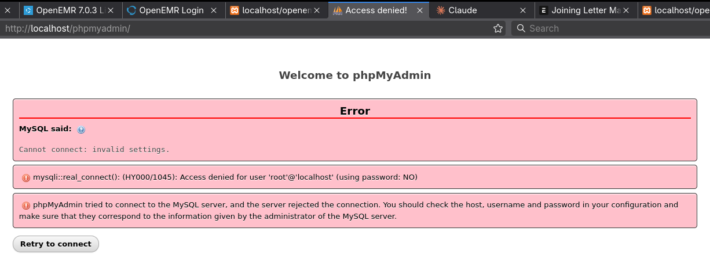

```

Welcome to phpMyAdmin

Error

MySQL said: Documentation
Cannot connect: invalid settings.
mysqli::real_connect(): (HY000/1045): Access denied for user 'root'@'localhost' (using password: NO)
phpMyAdmin tried to connect to the MySQL server, and the server rejected the connection. You should check the host, username and password in your configuration and make sure that they correspond to the information given by the administrator of the MySQL server.

```





---


