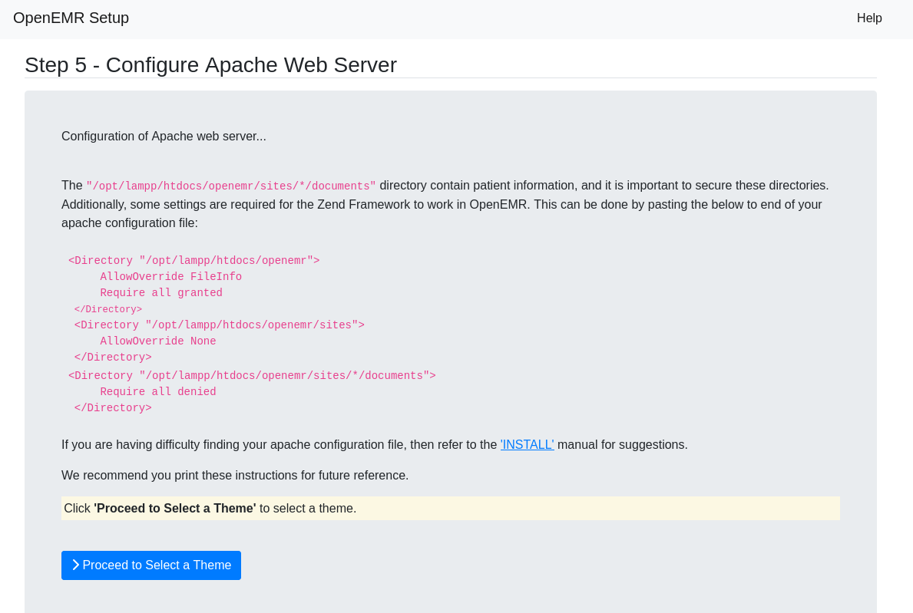

## Open EMR

- URL: https://www.open-emr.org/

- The world's leading open-source medical record software.


## Demo

- https://www.open-emr.org/demo/

# EMR User Credentials

| Username | Password | Description |
|----------|----------|-------------|
| admin | pass | Administrator |
| physician | physician | Physician (more access than clinician) |
| clinician | clinician | Clinician (less access than physician) |
| accountant | accountant | Accountant |
| receptionist | receptionist | Front desk receptionist |


## Patient Portal Demo

## Patient Credentials

| Patient | Username | Password | Email |
|---------|----------|----------|-------|
| Phil | Phil1 | phil | heya@invalid.email.com |
| Susan | Susan2 | susan | nana@invalid.email.com |

## Demo Links

| Service | Version | URL |
|---------|---------|-----|
| OpenEMR Portal Demo | 7.0.3 | https://demo.openemr.io/openemr/portal |


---


### Installation:

Url: https://www.open-emr.org/wiki/index.php/OpenEMR_Downloads


## Linux: 

- Download Link: https://sourceforge.net/projects/openemr/files/OpenEMR%20Current/7.0.3/openemr-7.0.3.tar.gz/download

- Installation Guide:
    - https://www.open-emr.org/wiki/index.php/OpenEMR_7.0.3_Linux_Installation

- Download XAMPP in for Linux: 
    - https://sourceforge.net/projects/xampp/
    - Install XAMPP
        -  sudo ./xampp-linux-x64-8.2.4-0-installer.run 


Installing OpenEMR
Extracting the Tarball

1. First, Download OpenEMR from sourceforge:

        openemr-7.0.3.tar.gz (MD5 sum: 103a68d11f9e3df6db87d47918c15267)

2. Next, Extract the downloaded archive:

    tar -pxvzf openemr-7.0.3.tar.gz

3. Move the extracted openemr-7.0.3 directory to your webserver root directory, and then go to this directory. Refer to your OS and webserver documentation to obtain your webserver root directory. For example, Ubuntu's webserver root directory is /var/www/html, so in Ubuntu you would use the following commands:

    mv openemr-7.0.3 /var/www/html/openemr
    cd /var/www/html

Some other common webserver root directories are:

    Mandriva: /var/www/html/
    The FHS: /srv/www/


- XAMPP not working!
---


### Restarting XAMPP:

```bash
atuld@fedora:~$ cd /opt/lampp/
atuld@fedora:/opt/lampp$ ls
apache2  cgi-bin       error   icons    info   lib64     logs                   manual   pear        proftpd         README-wsrep  share       uninstall      xampp
bin      ctlscript.sh  etc     img      lampp  libexec   man                    modules  php         properties.ini  RELEASENOTES  temp        uninstall.dat
build    docs          htdocs  include  lib    licenses  manager-linux-x64.run  mysql    phpmyadmin  README.md       sbin          THIRDPARTY  var
atuld@fedora:/opt/lampp$ sudo ./man
man/    manual/ 
atuld@fedora:/opt/lampp$ sudo ./man
man/    manual/ 
atuld@fedora:/opt/lampp$ sudo ./manager-linux-x64.run
[sudo] password for atuld: 
```


#### Applying PHP Settings

- URL: https://www.open-emr.org/wiki/index.php/FAQ#What_are_the_correct_PHP_settings_.28can_be_found_in_the_php.ini_file.29.3F

```php
short_open_tag = Off
max_execution_time = 60
max_input_time = -1
max_input_vars = 3000
memory_limit = 512M
display_errors = Off
log_errors = On
post_max_size = 30M
file_uploads = On
upload_max_filesize = 30M
error_reporting = E_ALL & ~E_NOTICE & ~E_STRICT & ~E_DEPRECATED
mysqli.allow_local_infile = On


```


## The Setup:


1. Database details:
    - User login and password
    - root password

2. Initial user details
    - DXW-admin-20
    - DXW-admin-2076


This will setup the openemr database




Updated in : /opt/lampp/apache2/conf/httpd.conf


Choose theme


## Initial login:


Login using the initial user credential created. 

Site live at : http://localhost/openemr